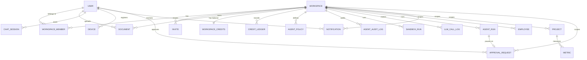

# Phase 1 Data Model: AISAT-INTEL MVP (Phase 1)

**Date**: 2026-06-06 | **Plan**: [plan.md](./plan.md) | **Spec entities**: see [spec.md](./spec.md) Key Entities

All primary keys are UUID v7 (time-sortable). All tenant-scoped tables carry `workspace_id NOT NULL` and a PostgreSQL RLS policy (`USING (workspace_id = current_setting('app.workspace_id')::uuid)`) set by the Tenant middleware via `SET LOCAL app.workspace_id`. The middleware also sets `SET LOCAL app.user_id` (recipient-scoping RLS for `notifications`) and `SET LOCAL app.clearance`. Phase 1 enforces document clearance at the Qdrant payload filter and the library-list repo query — **not** in RLS, which scopes only `workspace_id`; establishing the `app.clearance` GUC now is a defense-in-depth seam so the Phase 2 second access axis adds `app.principals` + a single RLS/payload predicate additively (see [draft-plan.md — Access model](../draft-plan.md#access-model-decided), formalized as the swappable `Authorizer`/`Policy`/`Lowerer` ports in [contracts/authorizer-ports.md](./contracts/authorizer-ports.md) — the `app.*` GUC bundle is that contract's SQL lowering) rather than introducing new request-context plumbing later. Tables noted as partitioned use `PARTITION BY RANGE (created_at)` (or the noted column); expiry is a partition `DROP`. Soft delete via `deleted_at` where noted.

Layer legend: **K** = kernel (template-level, reusable across products) · **P** = product (ContextEngine-specific).

## Entity catalog

### User (K)
The authenticating person.
- `id`, `email` (unique), `password_hash`, `email_verified_at`, `mfa_enabled`, `created_at`, `updated_at`, `deleted_at`
- Rules: email unique; `email_verified_at` gates relaxed new-account budgets (FR-020).

### Workspace (K)
The tenant boundary and unit of isolation.
- `id`, `slug` (unique), `name`, `tenant_id`, `owner_id` → User, `created_at`, `updated_at`, `deleted_at`
- Config (via `product.config.yaml` / settings): `warning_threshold_pct` (default 80, FR-017), `max_upload_bytes` (default 52428800 = 50 MB, FR-003), `default_access_level`, `byok_enabled` (admin toggle, FR-026).
  - *Phase 2 (deferred):* `clearance_scheme` — the level **count (2–5) and labels** become workspace config so a customer's own scheme replaces the five default names. Only the integer reaches `documents.access_level` and the Qdrant payload, so renaming is display-only; reducing the count requires an explicit per-document remap. See [draft-plan.md — Access model](../draft-plan.md#access-model-decided).
- Rules: complete isolation — no cross-workspace visibility (FR-014, SC-001).
- *Phase 2 (deferred):* an `organization` above Workspace becomes the billing entity and the home for SSO/SCIM, the group registry, and policy defaults. Workspace stays the **isolation boundary for content** — that does not change. See [draft-plan.md — Tenancy & Delegated Administration](../draft-plan.md#phase-2--tenancy--delegated-administration).

### Workspace Member (K)
Association of a User to a Workspace.
- PK (`workspace_id`, `user_id`); `access_level` INT (1–5), `role` (`owner`|`admin`|`member`), `status` (`active`|`invited`|`suspended`), `invited_by`, `joined_at`
- Rules: `access_level` ∈ [1,5] (Clarification Q1); a member sees own docs + shared docs at ≤ their level (FR-007, FR-013); only owner/admin manage membership (FR-015).

### Invite (K)
Pending, revocable invitation.
- `id`, `workspace_id`, `email`, `role`, `clearance`/`access_level`, `token_hash`, `expires_at`, `accepted_at`, `created_by`
- Rules: revocable; accept assigns role + clearance (FR-015, US3-AS3).

### Document (P)
An ingested unit of knowledge. Partitioned by `created_at`.
- `id`, `workspace_id`, `user_id` (owner), `s3_key`, `source_type` (`pdf`|`docx`|`markdown`|`image`|`note`), `tags[]`, `summary`, `data_type`, `access_level` INT (1–5), `scope` (`personal`|`workspace`), `created_at`, `updated_at`, `deleted_at`
- A **note** is a Document with `source_type='note'` (see Note below); it inherits all security/clearance/RLS/embedding behavior — no parallel entity. `crawl` is no longer a user-facing `source_type`; web crawling is now an internal fetch step of note enrichment (FR-001).
- Security fields (`workspace_id`, `user_id`, `tenant_id`, `access_level`) are stamped server-side from the authenticated upload context — never model-inferred (FR-004/FR-005). `access_level` defaults to the uploader's own clearance when unset (Clarification Q1) and may never exceed it.
- State transitions (ingestion status, tracked on the ingestion job / SSE, not necessarily a column): `received → converting → extracting_metadata → chunking → embedding → indexed` | `unsupported_type (501 stub)` | `rejected_oversize` | `dlq_parked` (embed-provider outage) | `failed`.

### Note (P) — a Document with `source_type='note'`
A user-authored knowledge unit with optional web-link enrichment (FR-001).
- Additional fields on the Document row: `body` TEXT (user-authored; the **only** embedded/indexed content), `source_links[]` JSONB (attached URLs supplied as enrichment inputs), `citations[]` JSONB (`[{ url, title, fetched_at, content_hash }]`, metadata only — not embedded), `enrich_status` (`none`|`drafting`|`drafted`|`accepted`).
- **Enrichment** (member-initiated, re-runnable): the enrich worker crawls `source_links`, distills each page aligned to `body`, and streams a draft. The draft is **never persisted** — it lives client-side until the member accepts. On accept, `body` + `citations[]` are persisted and the note follows the normal ingestion path (chunk → embed → indexed). Crawled pages are never embedded separately, keeping the persistent injection surface minimal (research §3).
- **Human-in-the-loop**: `enrich_status='drafted'` corresponds to a pending `approval_request(kind='enrich_accept', subject_type='note', subject_id=note.id)` — the accept-gate is the canonical Phase-1 instance of the reusable `HumanGate` port. Accepting is the **resolve** of that gate (indexing crawled content is the gated action, so no external content mutates the index without explicit approval, FR-040); re-enriching supersedes the draft under a fresh gate. An **agent** edit to a note (FR-041, `edit_note` tool) uses the same port with `kind='note_edit'`: the proposed diff updates `body` and re-indexes **only** on member approval, bounded by the Authorizer `Permit(ActionUpdate)` + `WriteEnvelope` floor and `min(agent, owner)` clearance — the agent may edit only the owner's own personal notes or shared workspace notes ≤ its clearance, and may not create a new note (SC-015). See [contracts/approval-ports.md](./contracts/approval-ports.md).
- A bare URL with no body creates a note whose draft body is the page summary, under the same accept gate.

### Chat Session (P)
A member's conversational thread with remembered context. Partitioned by `HASH (user_id)`.
- `id`, `workspace_id`, `user_id`, `mem0_session_id`, `created_at`
- Rules: session context retained for coherent follow-ups (FR-009); Mem0 injects per-user memory at the `memory` node (Node 5). Suggested follow-up questions are generated by the `suggest` node (post-generate) and delivered via the `suggestions` SSE event — they are ephemeral and never persisted (FR-031). Node names/IO per [contracts/agent-graph.md](./contracts/agent-graph.md).
- **Memory access-control invariant** (research §13): every Mem0 memory carries `workspace_id`, `user_id`, and an `access_level` stamp = the highest `access_level` among the chunks/answer that produced it. Node 5 injects a memory only when `workspace_id == ctx AND user_id == ctx AND access_level <= effective_access_level` against the requester's **current** clearance — so a memory distilled from a doc above current clearance (e.g., after an L4→L2 demotion) is never injected (SC-001).

### Credit Balance & Ledger (P)
- `workspace_credits` (K-adjacent): PK `workspace_id`, `balance` INT, `updated_at` — authoritative copy is the Redis hot key; this row is the durable mirror.
- `credit_ledger`: `id`, `workspace_id`, `user_id`, `operation_type` (includes `reconcile` and sandbox compute `sandbox.crawl`/`sandbox.convert`/`sandbox.run_script`), `credits_used` INT, `idem_key` TEXT, `trace_id`, `created_at`. Partitioned by `created_at`. **`UNIQUE (idem_key) WHERE idem_key IS NOT NULL`** prevents double-debit (FR-019, SC-006).
- Rules: append-only; Redis balance = `SUM(ledger.delta) + grants`; rehydrate-on-cold-start + hourly reconciliation (research §3). The **Go kernel billing worker is the sole `credit_ledger` writer** (`backend-go/kernel/billing/`); Python spend producers only publish `billing.deduct` events and never write the ledger.
- **Reusability seam**: this table is the durable backing of the domain-agnostic `Ledger`/`LedgerWriter` ports — `workspace_id` is the reference binding of the opaque `Scope`, `operation_type` = the port's `Reason`, and cost is produced by a `Pricer` (LLM-token pricing is one implementation). See [contracts/metering-ports.md](./contracts/metering-ports.md) for the ports + generalization checklist.

### AI Operation Record / LLM Call Log (P)
Per-metered-call record for cost dashboard. Partitioned by `created_at`.
- `llm_call_log`: `id`, `workspace_id`, `user_id`, `feature`, `model`, `provider`, `input_tokens`, `output_tokens`, `cached_tokens`, `cost_usd_micros` BIGINT, `cache_hit` BOOL, `duration_ms`, `trace_id`, `created_at`
- No raw message bodies (FR-024). Drives `llm_cost_daily` materialized view (admin dashboard, FR-022).

### Agent Policy (P)
Per-role rules governing tools/budgets/hooks.
- `agent_policies`: `id`, `workspace_id`, `agent_role` (`user`|`admin`|`automation`|`integration`), `allowed_tools[]` (MCP tool names), `token_budget_day` INT, `max_loop_depth` INT (default 20), `hooks_enabled[]` (`audit`|`langfuse`|`garak`), **`can_write` BOOL (default false)**, **`write_ops[]`** (Phase 1: only `note_update`), **`write_max_level` INT** (upper bound on an agent write's access level, ≤ owner clearance), `created_at`
  - **Phase 1 write scope (narrow, HITL-gated):** `can_write` + `write_ops=['note_update']` enable the FR-041 `edit_note` tool — editing an **existing** note within `min(agent, owner)` clearance, every commit gated by the human-gate (`approval_request(kind='note_edit')`) and bounded by the Authorizer `WriteEnvelope` floor ([contracts/authorizer-ports.md](./contracts/authorizer-ports.md) invariants 7–8). Off by default; admin-enabled per role.
  - *Phase 2 (deferred):* the **broad** write scope (`write_max_level` beyond notes, `writable_principals`, `write_artifact_types`, document **creation**) and an agent-owned clearance/principal set independent of its owner. See [draft-plan.md — Agent Access & Accountability](../draft-plan.md#phase-2--agent-access--accountability).
- Rules: allowlist enforced on every dispatch (FR-011/FR-012, injection defense); Phase 1 allowlist is read-only tools **plus** the two HITL-gated action tools (`web_search`, `edit_note`) when enabled per role (FR-041). A write dispatch additionally checks `can_write` + `write_ops` and routes through the human-gate + Authorizer `Permit`/`WriteEnvelope` before committing (SC-015).

### Audit Record (P + K)
- `agent_audit_log` (P): `id`, `workspace_id`, `user_id`, `agent_role`, `tool_called`, `token_cost`, `result_hash` (tamper-evident), `trace_id`, `created_at`. Partitioned by `created_at`.
- `audit_log` (K): generic workspace/member actions — `id`, `workspace_id`, `actor_type`, `actor_id`, `action`, `resource_type`, `resource_id`, `metadata` JSONB, `created_at`. Partitioned by `created_at`.
- Rules: append-only; AI tool calls and workspace/member actions both audited (FR-023).

### Sandbox Run Record (P)
Per-execution record for the sandbox tier (crawl / convert / code-gen microVMs) — the sandbox analogue of `agent_audit_log`. See [contracts/sandbox-runtime.md](./contracts/sandbox-runtime.md).
- `sandbox_run` (P): `id`, `workspace_id`, `user_id`, `template` (`tmpl-crawl`|`tmpl-convert`|`tmpl-coderun`), `feature` (`ingest.crawl`|`ingest.convert`|`agent.run_script`), `exit_code` INT, `vcpu_seconds` INT, `wall_ms` INT, `egress_bytes` BIGINT, `timed_out` BOOL, `result_hash` (tamper-evident), `trace_id`, `created_at`. Partitioned by `created_at`.
- Rules: append-only; **exactly one row per sandbox execution** (contract-test obligation). Compute is metered by publishing `billing.deduct.<ws>` with `operation_type ∈ {sandbox.crawl, sandbox.convert, sandbox.run_script}` — the **Go kernel billing worker stays the sole `credit_ledger` writer** (SC-006); the Python sandbox client only writes this audit row and emits the spend event. **No file contents or generated-code bodies are stored** here (only `result_hash`), matching the `llm_call_log` no-body rule (FR-024). A sandbox holds no ambient credentials and no DB/Qdrant access; results re-enter the index only through the normal pipeline / HITL accept gate, so this record cannot widen access (SC-001, research §24).

### Connected Device (P)
A registered local agent.
- `devices`: `id`, `user_id`, `workspace_id`, `name`, `agent_type` (`hermes`|`openclaw`|`nanobot`|`picoclaw`|`zeroclaw`|`claude`|`other`), `llm_mode` (`proxy`|`byok`), `pat_hash`, `last_seen_at`, `expires_at`, `revoked_at`, `created_at`
- Rules: PAT scoped to user + workspace, expires 90d, rotatable, revocable from UI (FR-025); `workspace_id` resolved from PAT, never request body (FR-027).

### Long-Horizon Task Run (P)
Durable record of a multi-step agent task. Partitioned by `started_at`.
- `agent_run`: `id`, `workspace_id`, `user_id`, `agent_role`, `status` (`queued`|`running`|`paused`|`completed`|`failed`|`cancelling`|`cancelled`), `current_step` INT, `state` JSONB (checkpoint **pointer** — `{ thread_id, checkpoint_ns, checkpoint_id, node, step }`, **not** the state payload), `result` JSONB, `error`, `credits_cap` INT, `credits_spent` INT, `trace_id`, `started_at`, `last_heartbeat_at`, `completed_at`
- Rules: heartbeat every 10s + janitor re-queue on stale heartbeat; cancel propagation via `cancelling`→`cancelled`; hard per-run `credits_cap` checked after each step, independent of daily budget (FR-028, SC-009). Only `intent=long_horizon` creates a row. **`paused` = interrupted at a human-gate** (FR-040): the run hit an `interrupt()` at the `human_gate` node, a matching `approval_request(kind='long_horizon_action', status='pending')` row exists, the Redis checkpoint holds the interrupt payload, and **no credits are spent while paused**; resolving the approval publishes `agent.resume.<ws>`, which resumes the run **exactly once** via `Command(resume=decision)` from that checkpoint — a reject/expire ends it cleanly and the action never runs (SC-014, [contracts/approval-ports.md](./contracts/approval-ports.md)). **Checkpoint source-of-truth**: the LangGraph Redis checkpointer (`RedisSaver`, AOF) is authoritative for graph state, keyed by `thread_id` (= `agent_run.id`); `state` JSONB is only the durable pointer used to *locate* that checkpoint on resume. A pointer whose Redis checkpoint is gone (AOF gap/failover) transitions the run to `failed('checkpoint_lost')` — never a silent restart, which would re-spend settled credits ([contracts/agent-graph.md](./contracts/agent-graph.md) Checkpointing & resumption).

### Approval Request (K)
Durable, recipient-scoped record of a human-in-the-loop gate — the backing of the reusable `HumanGate`/`ApprovalStore` ports (FR-040, SC-014; [contracts/approval-ports.md](./contracts/approval-ports.md)).
- `approval_request`: `id`, `workspace_id`, `user_id` (the approver/recipient), `kind` (`enrich_accept`|`long_horizon_action`|`sensitivity_confirm`|`web_search`|`note_edit`), `subject_type` (`note`|`agent_run_step`|`document`|`web_search`), `subject_id`, `prompt` TEXT (human-readable "what am I approving?"), `requested_payload` JSONB (draft ref / step description / suggested `access_level`), `status` (`pending`|`approved`|`rejected`|`expired`), `decision` JSONB (`{verdict: approve|reject|edit, resume_value, resolved_by, resolved_at, note}`), `resolved_by`, `resolved_at`, `idem_key`, `expires_at`, `created_at`. Constraints: **`UNIQUE(workspace_id, kind, subject_id) WHERE status='pending'`** (one live gate per subject) + **`UNIQUE(user_id, idem_key)`** (create idempotency); index `(user_id, status, created_at)` for the pending-inbox query.
- Rules: RLS restricts rows to `user_id = current_setting('app.user_id')::uuid` within `workspace_id` — a gate is visible/resolvable only by its approver, never another member or across workspaces even at L5 (FR-040, SC-014, parity with SC-012). **Fail-closed**: a `pending` gate never lets its action proceed; a scheduled sweep (`approval.expire.tick`) flips overdue `pending`→`expired`. Resolving is idempotent (first decision wins). The `decision` is **human-authored, never derived from model/tool/document output** (research §5, FR-011). **Zero credits** are spent and **no subject side effect** occurs while `pending` (refuse-before-spend, parity with the `guard` node). Every resolution writes an `audit_log` row (FR-023).
- **Reusability seam**: this table is the durable backing of the domain-agnostic `HumanGate`/`ApprovalStore` ports — `workspace_id`+`user_id` are the opaque `Tenant`+`Approver`, `kind`+`subject_type`+`subject_id` the `Subject`, `decision` the `Decision`. Adding a gate type (the Phase-1 `web_search`/`note_edit`, or a future broad-write/messaging tool) is a new `kind` value, **not** a schema change. See [contracts/approval-ports.md](./contracts/approval-ports.md).

### Structured Records (P, demo Tier 2)
Workspace-scoped operational data answerable via fixed tools.
- `employees` (`id`, `workspace_id`, `name`, `role`, `department`)
- `projects` (`id`, `workspace_id`, `name`, `status`, `owner_id`)
- `metrics` (`id`, `workspace_id`, `project_id`, `metric_name`, `value`, `recorded_at`)
- Rules: queried only by fixed parameterized tools, never free-form SQL (FR-008).

### Notifications (K)
Recipient-scoped record of a workspace event, surfaced in-app and optionally by email (US8).
- `notifications`: `id`, `workspace_id`, `user_id` (recipient), `category` (`ingestion_complete`|`ingestion_failed`|`invite_received`|`invite_accepted`|`invite_revoked`|`credit_warning`|`credit_exhausted`|`task_halted`|`approval_requested`|`doc_shared`|`clearance_changed`|`member_joined`|`admin_broadcast`), `priority` (`info`|`warning`|`critical`), `title`, `body`, `payload` JSONB (resource refs for deep-linking: `doc_id`/`invite_id`/`run_id`/`job_id`), `idem_key` (de-dupes redelivered/retried events), `read_at` (NULL = unread), `created_at`, `UNIQUE(user_id, idem_key)`
- `notification_outbox`: `id`, `notification_id` (FK → `notifications`), `workspace_id`, `channel` (`in_app`|`email`|…), `attempts` INT, `next_attempt_at`, `delivered_at` (NULL = pending), `last_error`, `created_at`. One row per enabled channel, **inserted in the same transaction as the `notifications` row** so a crash between persist and delivery cannot lose a channel send; drained at-least-once by the `Dispatcher` (see [notification-ports.md](./contracts/notification-ports.md), invariant 4). `UNIQUE(notification_id, channel)`. Index on `(delivered_at, next_attempt_at)` for the drain claim.
- `notification_preferences`: `id`, `user_id`, `workspace_id`, `category`, `in_app` BOOL, `email` BOOL, `UNIQUE(user_id, workspace_id, category)`
- `email_suppressions`: `id`, `email` (citext, `UNIQUE`), `reason` (`hard_bounce`|`complaint`|`unsubscribe`), `created_at` — addresses to which email is no longer sent (FR-035)
- Rules: RLS restricts `notifications` to `user_id = current_user` within `workspace_id` — a notification is never visible to any other member or across workspaces, even at L5 (FR-036, SC-012). The notification service applies `notification_preferences` before delivery; an absent preference row uses the category default (in-app on; email on for `credit_warning`, `credit_exhausted`, `invite_received`, `task_halted`, `approval_requested`, off otherwise — `approval_requested` defaults email-on because a paused agent action is actionable and time-sensitive) (FR-035). Delivery is idempotent: the persist step writes the `notifications` row **and one `notification_outbox` row per enabled channel in a single transaction**, so a redelivered/retried event is a no-op via the `(user_id, idem_key)` unique constraint (one row, one delivery per channel). The `SET NX notify:applied:{idem_key}` guard is only a fast pre-check that gates the durable write — **never** channel delivery, which is driven off the durable outbox at-least-once (each channel idempotent on `idem_key`) so a crash between persist and send cannot silently drop an email (FR-032, SC-013; [notification-ports.md](./contracts/notification-ports.md), invariants 3–4). High-volume same-category bursts for one recipient are coalesced into a digest/rate-limited summary rather than one push + one email per event (FR-038). The email worker skips any address present in `email_suppressions` and adds rows on provider bounce/complaint webhooks; unsubscribe links flip the relevant `notification_preferences.email` to false (FR-035). Retention: read notifications older than a configured window (default 90 days) are pruned/archived so inbox + unread-count stay performant; the table MAY be range-partitioned by `created_at` for cheap drop (FR-039). Index on `(user_id, read_at, created_at)` for inbox + unread-count queries.

### Supporting kernel tables
- `api_keys` (K), `plans` (K), `subscriptions` (K), `feature_flags` (K), `token_usage_daily` (P, per-role daily token counter, partitioned by `usage_date`).
- `dead_letters` (K) — terminal store for poison messages that exhausted DLQ re-drive: `id`, `workspace_id`, `source_subject` (the originating work subject), `dlq_subject`, `payload` JSONB, `dlq_attempts`, `last_error`, `first_failed_at`, `dead_at`. RLS-scoped to `workspace_id`; admin-readable for inspection / manual replay. Written only by the DLQ sweeper once `dlq_attempts ≥ MAX_DLQ_ATTEMPTS` (default 5), which also emits a `dlq.dead.count` alert metric (research §18, FR-029/FR-035).
- The `plans` and `subscriptions` rows above are Phase 1 stubs (status/entitlement only).

### Billing & payments (Phase 2, US4-ext)

> Out of Phase 1 scope (see [spec.md](./spec.md) "Out of Scope"); full schema in [draft-plan.md — Phase 2 Billing & Payments](../draft-plan.md#phase-2-billing-and-payments). **Additive** to the credit backbone — `workspace_credits`, `credit_ledger`, and the consumption hot path are unchanged. A provider only converts fiat → credits (one-time top-up) or grants a recurring allotment (subscription), then appends a `credit_ledger` grant row keyed by `idem_key` (reuses the SC-006 double-debit guard). Money is integer minor units (`BIGINT` + ISO-4217 `currency`), never floats.

- `plans` (K) — **supersedes the stub above**: purchasable credit pack or subscription tier (`code`, `kind`, `price_minor`, `currency`, `credit_allotment`, `billing_interval`, `is_active`).
- `plan_provider_prices` (K) — maps one logical plan to each provider's external price/product ID (`stripe`|`polar`|`paypal`).
- `billing_customers` (K) — links a `workspace_id` to a provider customer record (workspace is the unit of billing).
- `subscriptions` (K) — **supersedes the stub above**: active recurring entitlement with webhook-driven `status`, period bounds, and `cancel_at_period_end`.
- `payments` (K) — fiat transaction record (top-up or subscription invoice) for receipts/refunds/reconciliation; 1:1 with a `credit_ledger` grant via `idem_key`.
- `payment_events` (K) — verified provider webhook dedup + audit (`UNIQUE (provider, provider_event_id)`, AP4).

### Document Versioning (Phase 2 — agent file edits)

Needed by the agent `transform_files` tool: an approved run **replaces the document's current
content in place and retains the prior bytes as a version**. Append-only — a version row's
`s3_key` is never overwritten or deleted, which is the entire reason this shape was chosen
over an artifact-only write-back.

- `document_versions` (P): `id`, `workspace_id` (RLS), `document_id` FK, `version_no` INT,
  `s3_key`, `content_hash`, `byte_size`, `created_via` (`member_upload`|`agent_edit`),
  `created_by_user_id`, `agent_run_id` FK NULL, `sandbox_run_id` FK NULL,
  `approval_request_id` FK NULL, `created_at`. `UNIQUE (document_id, version_no)`.
- `documents.current_version_no` INT — the pointer; `documents.s3_key` always resolves to the
  current version's object.

Five rules, each load-bearing:

1. **Accountability lands on a human, not the agent.** On an `agent_edit`, `created_by_user_id`
   is the **approving member** — never the agent or its owner-by-default. This is what keeps
   FR-004's principle intact: a document's content still changes only through an authenticated
   human context, with `agent_run_id` / `sandbox_run_id` recording *how* it was produced.
2. **`access_level` never changes on an agent edit.** The `WriteEnvelope` floor that governs
   `edit_note` applies unchanged — an agent may not raise a document's access level, and edits
   are bounded by `min(agent, owner)` clearance.
3. **Re-index REPLACES, it does not append.** On commit, the prior version's Qdrant points and
   `chunks` rows are deleted and the new version is ingested (convert → chunk → embed) in the
   same idempotent unit, keyed by `document_version.id`. Getting this wrong is silent and
   corrupting: appending leaves stale chunks answering queries from content that no longer
   exists, and a partial delete leaves a document unsearchable.
4. **History is immutable; rollback moves forward.** Restoring version *N* creates version *N+1*
   carrying *N*'s bytes. Versions are never mutated or removed, so an approved-then-regretted
   agent edit is always recoverable.
5. **Rollback is a member action.** Never an agent tool — otherwise an agent could launder a
   rejected edit by restoring a version it authored.

## Vector store (Qdrant) payload schema

Two collections: `personal`, `workspace`. Every chunk payload:
```json
{
  "workspace_id": "uuid", "user_id": "uuid", "tenant_id": "uuid",
  "access_level": 2, "doc_id": "uuid", "chunk_index": 42,
  "parent_doc_id": "uuid", "is_child": true, "source_type": "pdf",
  "tags": ["finance", "Q3"], "hot": true, "created_at": "2026-06-03T00:00:00Z"
}
```
- Payload indexes: `workspace_id`, `user_id`, `access_level`, `hot`, `tags`.
- *Phase 2 (deferred):* a second access axis adds `allowed_principals` (TEXT[]) to the payload + payload indexes, filtered by array overlap alongside the existing `access_level` range check. Adding it later is a bulk `set_payload` backfill plus an index build — vectors are unaffected, so **no re-embedding is required**. See [draft-plan.md — Access model (decided)](../draft-plan.md#access-model-decided).
- **Dual-collection search strategy** — every RAG query searches both collections with different pre-filters, then merges results before reranking:
  - `personal` collection: `must = [workspace_id == ctx, user_id == requester_user_id]` — returns only the requester's own private docs; never any other member's personal docs regardless of clearance level.
  - `workspace` collection: `must = [workspace_id == ctx, access_level <= user_access_level]` — returns shared docs at or below the requester's clearance.
  - Merged results are RRF-interleaved, then reranked as a single candidate set (FR-007, SC-001).
- **Personal doc privacy invariant**: a chunk in the `personal` collection with `user_id != requester_user_id` MUST never appear in any search result, even for an L5 admin. This is enforced by the Qdrant payload filter above — not by prompt instructions.
- Chunking (research §16): **structure-aware** boundaries (split on headings / paragraph / sentence, never mid-sentence) feeding a **parent/child "small-to-big"** scheme — child = 200 tokens (embedded/searched), parent = 1000 tokens (linked by `parent_doc_id`, sent to the LLM). A flag-gated **contextual-retrieval** prefix (`chunking.contextual_prefix`, `fast` alias, per-doc summary reused) is prepended to each child *before* embedding to lift recall on context-poor fragments; the prefix is embedded with the child but is **not** a citation span.

## Relationships (high level)



## Validation & invariants (test targets)

| Invariant | Source | Enforcement point |
|-----------|--------|-------------------|
| A query never returns a doc above requester clearance or outside workspace | SC-001 (blocker) | Qdrant payload filter + Postgres RLS + eval hard assertion (FR-030) |
| `access_level` ∈ [1,5] and ≤ uploader clearance; defaults to uploader clearance | Clarification Q1, FR-004 | Ingestion service (server-side stamp) |
| No AI operation double-charged on retry/duplicate | SC-006, FR-019 | Redis idem guard + `credit_ledger.idem_key UNIQUE` |
| Redis balance reconciles to ledger within tolerance | SC-006 | Hourly reconciliation cron |
| Oversize upload rejected before ingestion/spend | Clarification Q4, FR-003 | Upload boundary (presign issuance) |
| Raw prompt/response purged at 30 days | Clarification Q5, FR-024 | Partition drop + PII scrub-before-write |
| Long-horizon run never exceeds `credits_cap` | SC-009, FR-028 | Per-step cap check in worker loop |
| A gated action never proceeds or spends while its approval is pending; unresolved/expired fails closed | SC-014, FR-040 | `approval_request.status` gate + refuse-before-spend in the caller + `approval.expire.tick` sweep |
| An approval is visible/resolvable only by an authorized approver within the workspace | SC-014 (blocker), FR-040 | `approval_request` RLS (`user_id` within `workspace_id`) + approver `Actor` check on resolve |
| A paused long-horizon run resumes exactly once on approval, no re-spend of settled credits | SC-009, SC-014 | `agent.resume.<ws>` idempotent + `Command(resume)` re-enters past the gate checkpoint |
| Disallowed/injection input refused before retrieval/spend | SC-007, FR-010 | LangGraph Node 0 moderation gate |
| A memory is injected only when its stamped `access_level` ≤ requester's current clearance | SC-001 (blocker), research §13 | Mem0 `access_level` stamp on write + Node 5 read-time clearance filter |
| A notification is visible only to its recipient, never to other members or across workspaces | SC-012 (blocker), FR-036 | `notifications` RLS (`user_id = current_user` within `workspace_id`) |
| A redelivered/retried event yields one notification, one delivery per channel | SC-013, FR-032 | `notifications.(user_id, idem_key) UNIQUE` + transactional `notification_outbox` (at-least-once drain, per-channel idempotent) + `SET NX` fast pre-check on the durable write only |
| Read notifications do not grow unbounded | FR-039 | Retention prune (default 90d) / range-partition drop on `created_at` |
| Email is not sent to a hard-bounced/complained/unsubscribed address | FR-035 | `email_suppressions` lookup in email worker + bounce/complaint webhook upsert |
| A DLQ-parked message is re-driven to its owning subject (reprocessed in the owning tier), not handled cross-tier in the sweeper | research §18 | DLQ sweeper re-publishes to the original work subject; owning worker idempotency |
| A poison message terminates in `dead_letters` after `MAX_DLQ_ATTEMPTS`, never re-driven forever | research §18 | DLQ sweeper attempt-cap + `dead_letters` write + `dlq.dead.count` alert |
